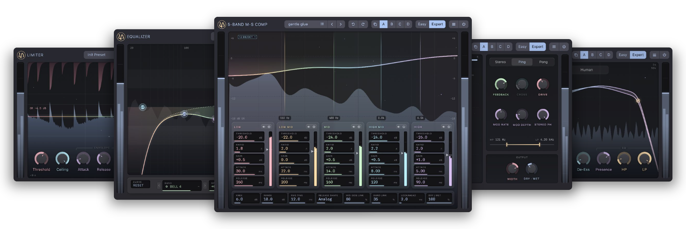
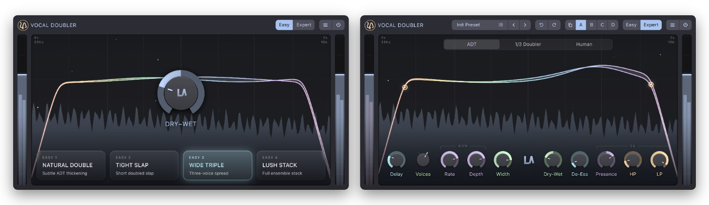

## A toolbox of 20+ beautiful sounding free and open source audio plugins

## Made for content creators, musicians and professional sound engineers.

[libreaudio.org](https://libreaudio.org)

---

## Easy and Expert

Every plugin has two faces.

**Easy** opens with a handful of controls that just work — a threshold, a ceiling, a colour.
Enough to finish a podcast, a track, a livestream.

**Expert** unfolds the whole engine — drawable transfer curves, lookahead, per-band mid/side,
sidechain filtering, detector timing. The same processor underneath, nothing held back and
nothing sold separately.

 
Vocal Doubler — Easy on the left, Expert on the right

One interface language runs through all of them, so metering, curve editors and knobs behave
the same everywhere. What you learn in one plugin carries into the next.

> Screenshots are work in progress — the interfaces are still moving.

## Platforms and formats

**Systems** — Linux · macOS · Windows

**Formats** — CLAP · VST3 · LV2

## Status

Pre-release. There is no download yet — the first release is still being put together.
Watch this repository or the [website](https://libreaudio.org) to hear about it.

Initial release is planned for 27.11.2026

## Building

Build instructions not yet available.

## Contributing

The project is not yet set up for outside contributions. Issues and bug reports are welcome
once the first release is out.

## Who made this

Created with ♥ in Berlin by experienced [mastering engineers](https://4ohm.de) and
[audio developers](https://falktx.berlin/).

Supported by the [Prototype Fund](https://www.prototypefund.de/).

## Licence

GPL-3.0

---

The typeface used in the branding is <a href="https://www.fontshare.com/fonts/chillax">Chillax</a> by Manushi Parikh, Indian Type Foundry, under the ITF Free Font License.

